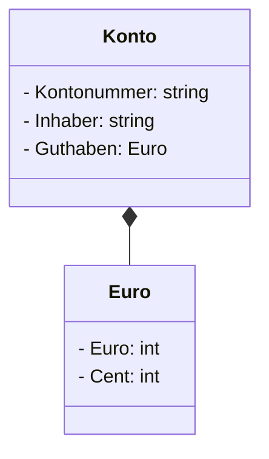

# Bankkonto

```mermaid
classDiagram
    class Konto {
        - Kontonummer: string
        - Inhaber: string
        - Guthaben: Euro
    }

    class Euro {
        - Euro: int
        - Cent: int
    }

    Konto *-- Euro
```
