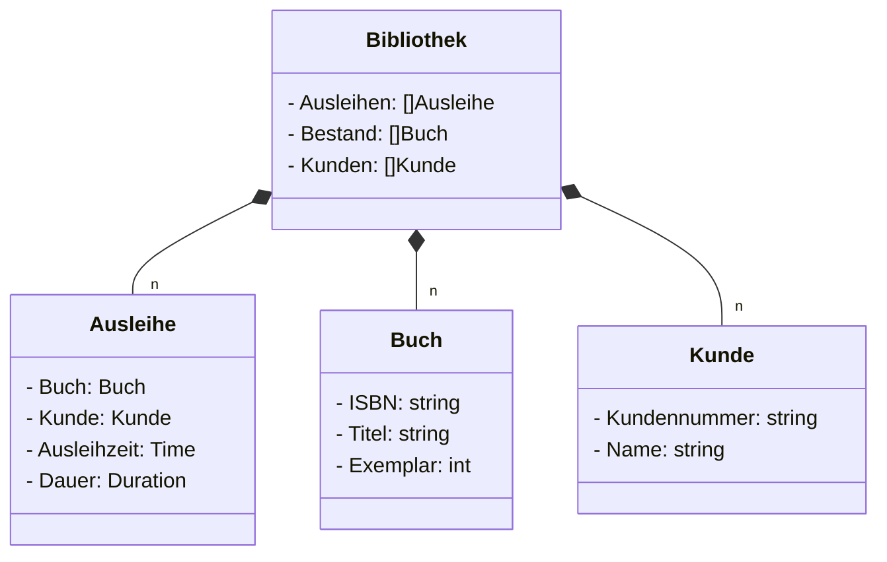

# Bibliothek

```mermaid
classDiagram
    class Bibliothek {
        - Ausleihen: []Ausleihe
        - Bestand: []Buch
        - Kunden: []Kunde
    }

    class Ausleihe {
        - Buch: Buch
        - Kunde: Kunde
        - Ausleihzeit: Time
        - Dauer: Duration
    }

    class Buch {
        - ISBN: string
        - Titel: string
        - Exemplar: int
    }

    class Kunde {
        - Kundennummer: string
        - Name: string
    }

    Bibliothek *-- "n" Ausleihe
    Bibliothek *-- "n" Buch
    Bibliothek *-- "n" Kunde
```
