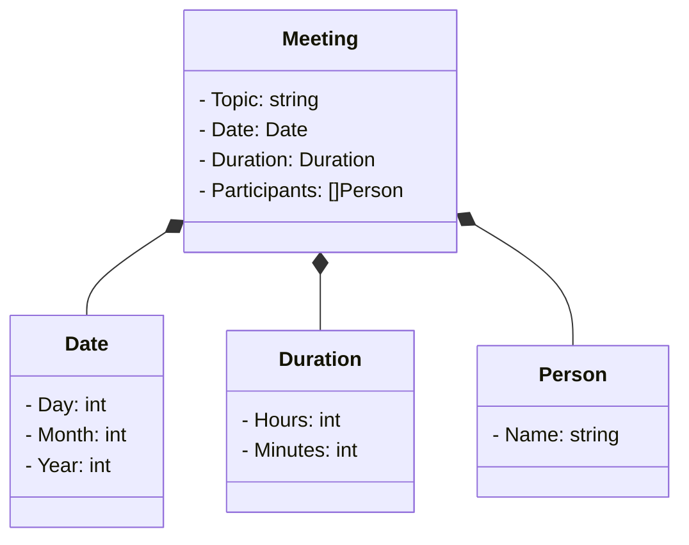

# Meetings

Dieses Package enthält Strukturen, die für die Beschreibung
von Meetings verwendet werden können.

```mermaid
classDiagram
    class Meeting {
        - Topic: string
        - Date: Date
        - Duration: Duration
        - Participants: []Person
    }
    class Date {
        - Day: int
        - Month: int
        - Year: int
    }
    class Duration {
        - Hours: int
        - Minutes: int
    }
    class Person {
        - Name: string
    }
    Meeting *-- Date
    Meeting *-- Duration
    Meeting *-- Person
```
